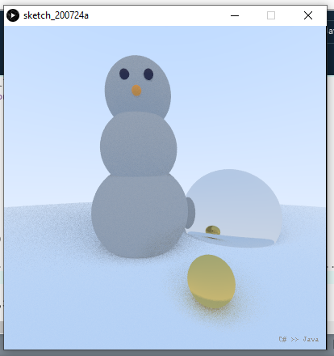
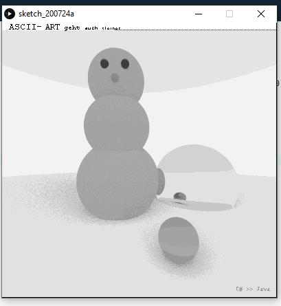

# Processing 3D Raytracer

A little raytracer (spheres only) I wrote in processing

The rules of the assignment limited the shape draw calls we were allowed to use. The idea was that students wouldn't submit overly complicated graphics.
But clearly text can be drawn with a single command...

